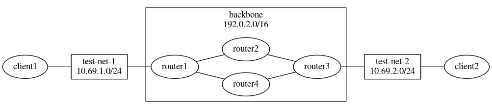

# A small BGP lab in Docker

This repository allows you to fire up four autonomous systems and two
clients with a single call to `docker-compose up`.

We use BIRD 2 on Alpine Linux.

## Network toplogy



## Running

Since docker-compose has problems with IPv6, you need to first create
three networks manually:

```sh
docker network create --subnet 2001:db8:bb:1::/64 --ipv6 backbone-v6
docker network create --subnet 2001:db8:69:1::/64 --ipv6 test-net-v6-1
docker network create --subnet 2001:db8:69:2::/64 --ipv6 test-net-v6-2
```

Now, you can build the images:

```sh
docker-compose build
```

And then launch the network:

```sh
docker-compose up
```

## Experiments

### End to end pinging

```sh
docker-compose exec client1 ping 10.69.2.11
```

### Trace route

```sh
docker-compose exec client1 traceroute -n 10.69.2.11
```

### Routing table

Display the routing table:

```sh
docker-compose exec router1 birdc show route
```

### Failover

Fire up two trace routes:

```
docker-compose exec client1 mtr -n 10.69.2.11
docker-compose exec client2 mtr -n 10.69.1.11
```

Log in to router2 or router4 and start disconnecting:

```
docker-compose exec router2 birdc
disable bgp1
disable bgp2
disable bgp3
disable bgp4
```

Watch how the route changes.

If you now take down the other router, packets will drop.

If you enable the first router again, transport will resume.

## To be done

I could not get IPv6 forwarding to work inside of Docker containers,
so you can see how the `2001:db:69:x::` routes propagate but not ping
them.

## Author

Created by Leah Neukirchen as a Mayflower Mayday project on 2020-01-10.

To the extent possible under law, the creator of this work has waived
all copyright and related or neighboring rights to this work.

http://creativecommons.org/publicdomain/zero/1.0/
